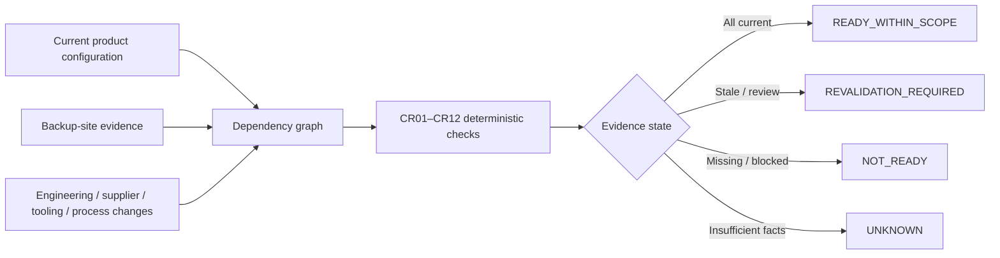
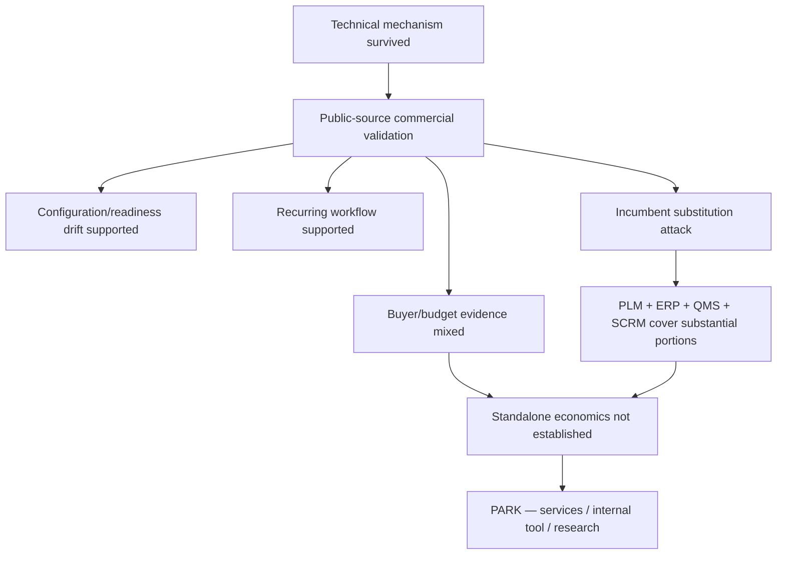

# FactoryDR

### Configuration-level manufacturing failover evidence — bounded technical + commercial falsification

**Independent research project · 2026**  
**Technical result:** `BOUNDED DETERMINISTIC MECHANISM SURVIVED`  
**Commercial decision:** `PARK — SERVICES / INTERNAL TOOL / RESEARCH`

> **In one sentence:** FactoryDR tested whether deterministic software could track when product/manufacturing changes make previously valid backup-site evidence no longer applicable to the current product configuration — and then separately tested whether that mechanism justified a standalone software company.

🌐 **[View the visual case study](https://llkavya21.github.io/Factorydr-research/)**\n\n[2-minute case study](CASE_STUDY.md) · [Methodology](methodology/FactoryDR_Methodology_and_Reproducibility.md) · [Evidence summary](evidence/EVIDENCE_SUMMARY.md) · [Claim boundaries](CLAIM_BOUNDARIES.md)

---

## Why this problem was worth testing

A backup manufacturing route can be qualified at one point in time. Later changes to the BOM, firmware, tooling, process, suppliers, tests, documentation or qualification scope can make earlier evidence stale or insufficient.

The bounded research question was:

> **Can deterministic software determine when changes make previously valid backup-manufacturing evidence no longer demonstrably applicable to the current product configuration?**

This is deliberately narrower than claiming that software can infer real physical factory readiness from databases alone.

## Research design



The candidate was frozen before held-out execution. The engine used structured facts and deterministic rules rather than an LLM, scenario-ID branching, randomness or network calls.

## Technical result

| Measure | Result |
|---|---:|
| Development vectors | **16 / 16 exact** |
| Development CR states | **192 / 192 exact** |
| Held-out overall outcomes | **4 / 4 exact** |
| Held-out CR states | **48 / 48 exact** |
| Combined scenario vectors | **20 / 20** |
| Combined CR classifications | **240 / 240** |
| Critical false `READY_WITHIN_SCOPE` | **0** |

The strongest justified technical claim is limited to the frozen **synthetic** experiment.

## Why the technical result did not become a startup claim



The commercial investigation found a real recurring workflow, but public evidence did not establish a sufficiently under-served, separately budgeted software category. Existing PLM, ERP, QMS and supply-chain-risk systems already cover substantial portions of the job.

## Public portfolio structure

```text
CASE_STUDY.md          2-minute recruiter / hiring-manager summary
CLAIM_BOUNDARIES.md    Exactly what the project does and does not prove
TECHNICAL_NOTES.md     State model, frozen identifiers and architecture
evidence/              Commercial evidence summary
methodology/           Research and reproducibility method
artifacts/             Freeze and implementation limitation records
docs/                  Visual portfolio page for GitHub Pages
```

The complete research archive — including frozen source code, public synthetic dataset, tests, reports, evidence workbook and private reproducibility artifacts — is maintained separately. Evaluator-private material and held-out input archives are intentionally not published here.

## Skills demonstrated

`Product research` · `Operations` · `Deterministic systems` · `Experiment design` · `Python` · `Structured data` · `Evidence grading` · `Competitive research` · `Build-vs-buy analysis` · `Technical documentation` · `Decision discipline`

## Author

**L. Kavya Nandini**  
Independent technology & startup research · 2026

---

**Important:** this project did not prove real factory readiness, customer demand, commercial traction, safety, quality, compliance or willingness to pay.
